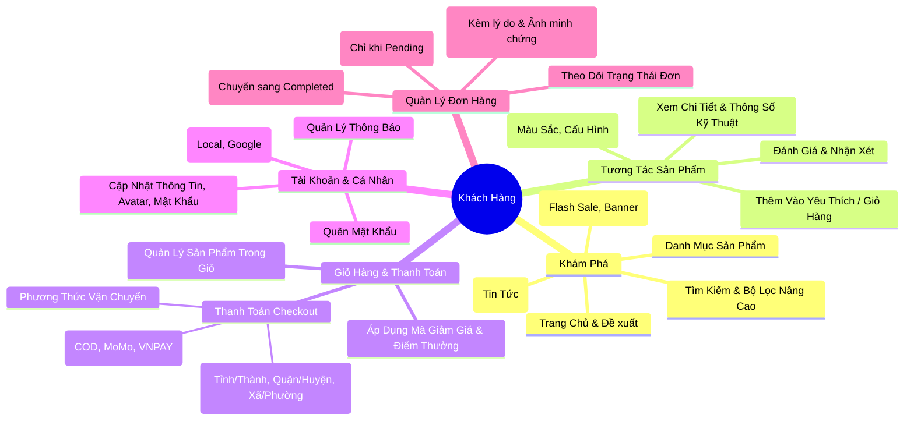
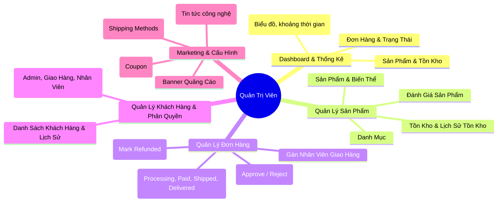
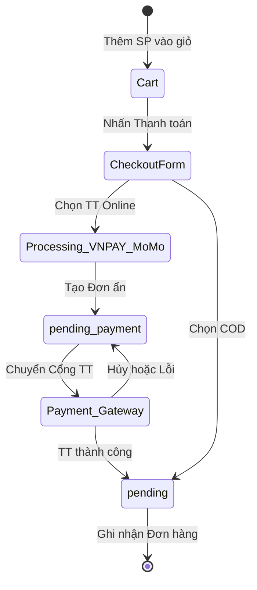
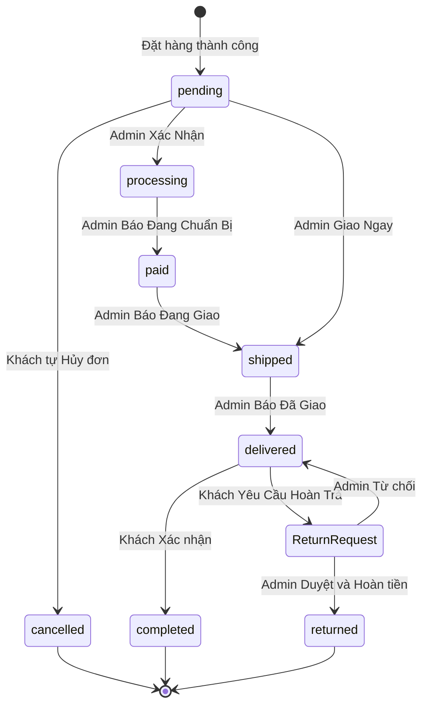
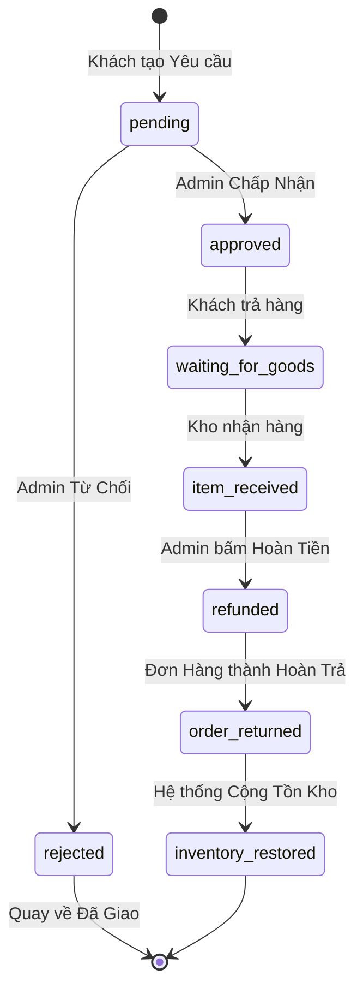
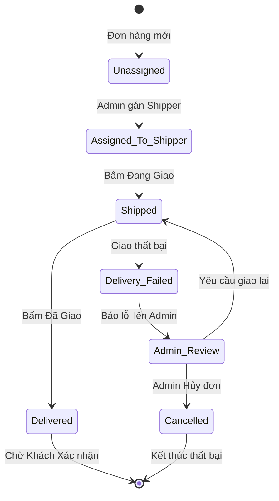
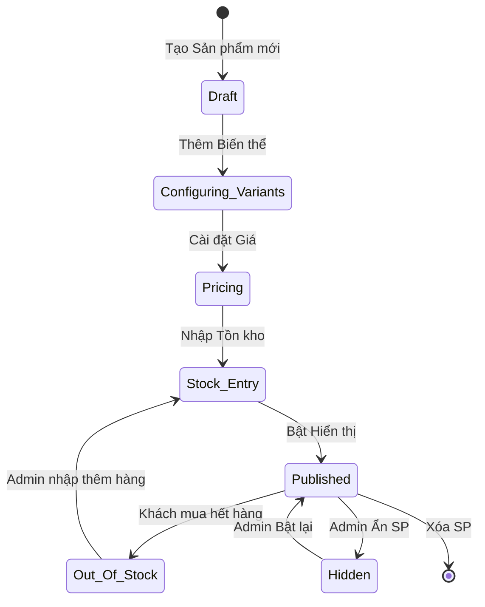
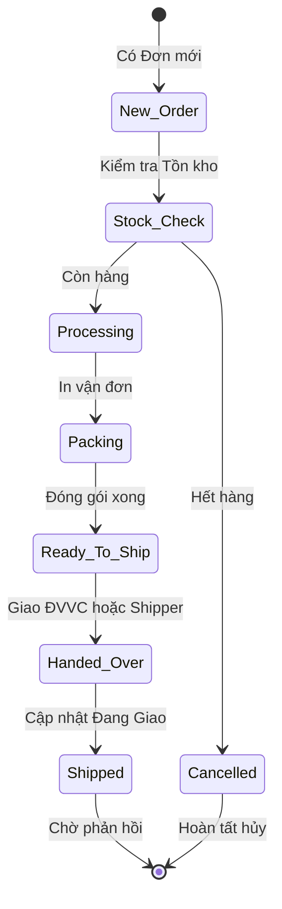

# Phân Tích Lưu Trình Người Dùng (User Flows)

Tài liệu này mô tả chi tiết các luồng nghiệp vụ (user flows) trong hệ thống E-Tech Market, được phân tích chặt chẽ dựa trên code thực tế của dự án. Hệ thống quản lý Khách Hàng, Quản Trị Viên (Admin), và Nhân Viên Giao Hàng.

---

## 1. Sơ Đồ Tư Duy Tổng Quan (Mindmaps)

### 1.1. Sơ Đồ Khách Hàng

### 1.2. Sơ Đồ Quản Trị Viên (Admin)

---

## 2. Lưu Trình Nghiệp Vụ Chặt Chẽ (Strict Flowcharts & State Machines)

Dựa trên code API backend, đây là các quy trình thực tế mà hệ thống cho phép.

### 2.1. Luồng Thanh Toán (Payment State Machine)

### 2.2. Vòng Đời & Trạng Thái Đơn Hàng (Order State Machine)
*(Ghi chú: Admin không thể chủ động chuyển đơn hàng sang trạng thái "Completed", "Cancelled" hay "Returned". Các trạng thái này bắt buộc phải đi qua hành động của Khách hàng hoặc luồng Hoàn trả).*

### 2.3. Luồng Hoàn Trả & Hoàn Tiền (Return & Refund State Machine)

### 2.4. Luồng Nhân Viên Giao Hàng Nội Bộ (Shipper State Machine)

### 2.5. Luồng Nghiệp Vụ Của Quản Trị Viên (Admin Operations)

Phần này đặc tả chặt chẽ các quy trình quản trị cốt lõi mà Admin thực hiện hàng ngày trên Dashboard.

#### A. Quản Lý Sản Phẩm & Tồn Kho (Product Management State Machine)

#### B. Xử Lý Phân Phối Đơn Hàng (Order Fulfillment State Machine)

