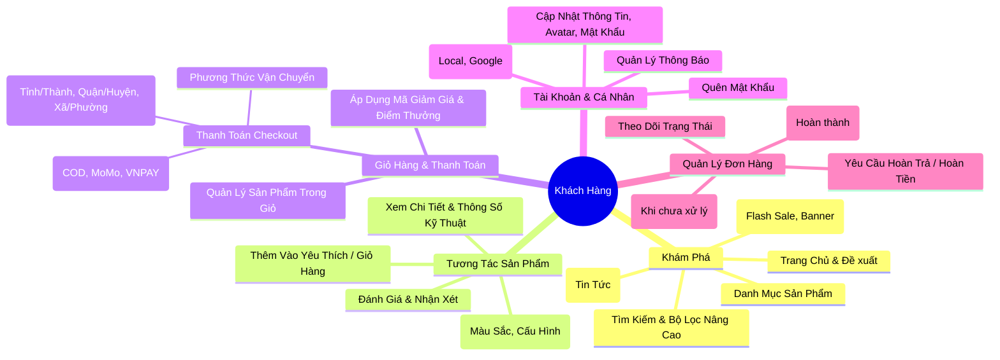
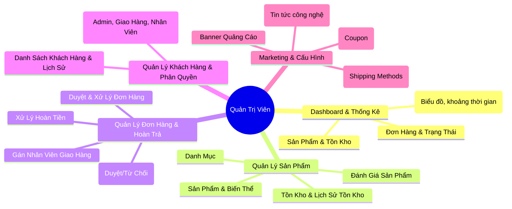
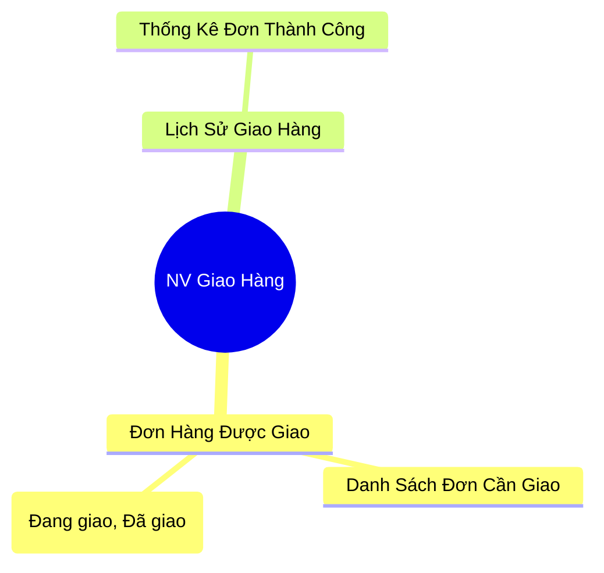
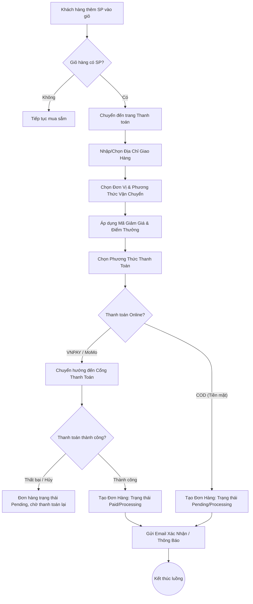
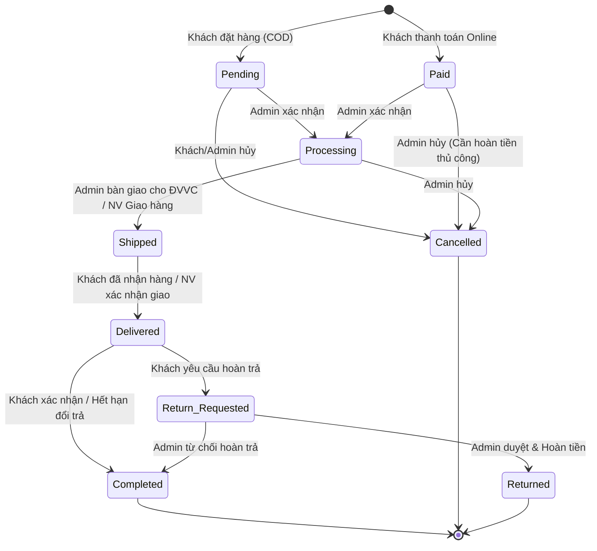
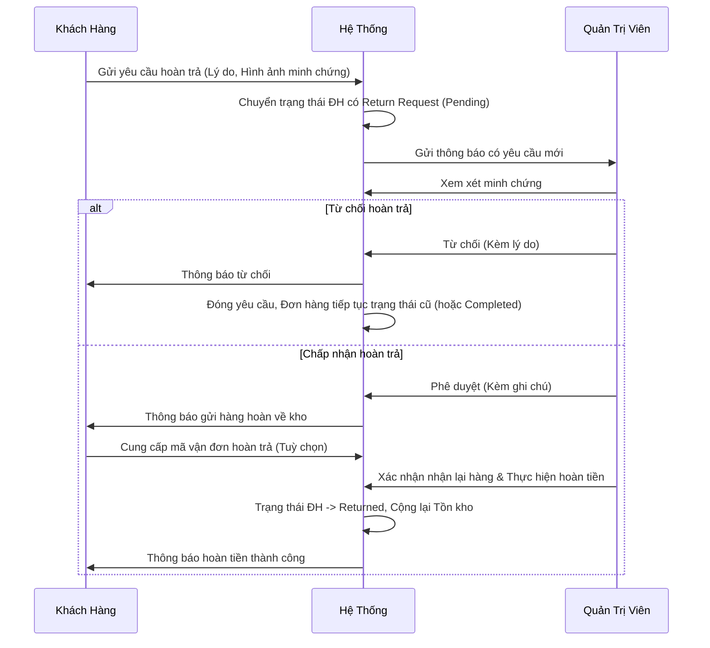
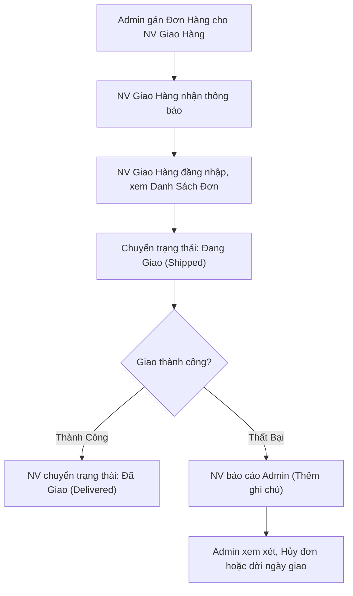

# Phân Tích Lưu Trình Người Dùng (User Flows)

Tài liệu này mô tả chi tiết các luồng nghiệp vụ (user flows) trong hệ thống E-Tech Market, bao gồm Khách Hàng, Quản Trị Viên (Admin), và Nhân Viên Giao Hàng.

---

## 1. Sơ Đồ Tư Duy Tổng Quan (Mindmaps)

### 1.1. Sơ Đồ Khách Hàng

### 1.2. Sơ Đồ Quản Trị Viên (Admin)

### 1.3. Sơ Đồ Nhân Viên Giao Hàng

---

## 2. Lưu Trình Nghiệp Vụ Chi Tiết (Flowcharts)

### 2.1. Luồng Mua Hàng & Thanh Toán (Checkout Flow)

### 2.2. Luồng Xử Lý Đơn Hàng (Order Processing Flow)

### 2.3. Luồng Hoàn Trả & Hoàn Tiền (Return & Refund Flow)

### 2.4. Luồng Giao Hàng Nội Bộ (Delivery Staff Flow)

