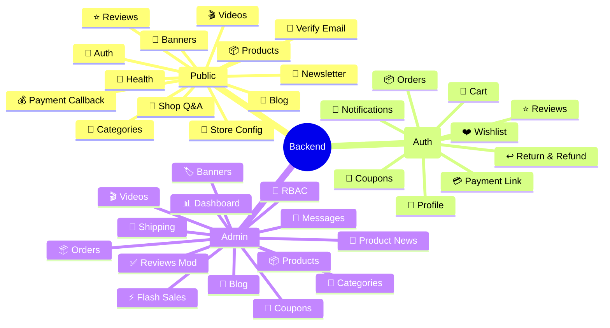

# E-Tech Market Backend

Laravel 10 RESTful API cho hệ thống thương mại điện tử E-Tech Market.

## 🛠️ Công Nghệ

- **Laravel 10**
- **PHP 8.1+**
- **PostgreSQL 15**
- **Redis** (Cache & Session)
- **Laravel Queue** (Email/Notifications bất đồng bộ)

## 📡 API Endpoints

### Public API (Không Auth)

| Endpoint | Mô Tả |
| :--- | :--- |
| `/api/auth/register` | Đăng ký tài khoản |
| `/api/auth/login` | Đăng nhập |
| `/api/auth/forgot-password` | Quên mật khẩu |
| `/api/auth/reset-password` | Đặt lại mật khẩu |
| `/api/auth/google` | Đăng nhập Google |
| `/api/auth/verify-email` | Xác thực email |
| `/api/health` | Health check |
| `/api/categories` | Danh sách danh mục |
| `/api/products` | Danh sách sản phẩm |
| `/api/products/{id}` | Chi tiết sản phẩm |
| `/api/flash-sales` | Flash Sale hiện tại |
| `/api/banners` | Danh sách banner |
| `/api/videos` | Danh sách video |
| `/api/products/{id}/reviews` | Đánh giá sản phẩm |
| `/api/blog-posts` | Danh sách bài viết |
| `/api/blog-posts/{id}` | Chi tiết bài viết |
| `/api/newsletter` | Đăng ký newsletter |
| `/api/store/config` | Cấu hình cửa hàng |
| `/api/shop-qna` | Shop Q&A |
| `/api/payments/vnpay/return` | VNPAY return |
| `/api/payments/vnpay/ipn` | VNPAY IPN |
| `/api/payments/momo/return` | MoMo return |
| `/api/payments/momo/ipn` | MoMo IPN |

### Auth API (User)

| Endpoint | Mô Tả |
| :--- | :--- |
| `/api/me` | Thông tin profile |
| `/api/profile` | Cập nhật profile |
| `/api/profile/avatar` | Cập nhật avatar |
| `/api/profile/password` | Đổi mật khẩu |
| `/api/cart` | Giỏ hàng |
| `/api/cart/add` | Thêm vào giỏ |
| `/api/cart/update` | Cập nhật giỏ |
| `/api/cart/remove` | Xóa khỏi giỏ |
| `/api/orders` | Danh sách đơn hàng |
| `/api/orders/{id}` | Chi tiết đơn hàng |
| `/api/orders/create` | Tạo đơn hàng |
| `/api/orders/{id}/cancel` | Hủy đơn |
| `/api/orders/{id}/confirm-received` | Xác nhận đã nhận |
| `/api/orders/{id}/confirm-payment` | Xác nhận thanh toán |
| `/api/orders/{id}/return` | Yêu cầu hoàn trả |
| `/api/orders/{id}/confirm-refund` | Xác nhận refund |
| `/api/payments/create-link` | Tạo link thanh toán |
| `/api/wishlist` | Danh sách yêu thích |
| `/api/wishlist/toggle` | Toggle yêu thích |
| `/api/notifications` | Danh sách thông báo |
| `/api/notifications/mark-read` | Đánh dấu đã đọc |
| `/api/reviews` | Gửi đánh giá |
| `/api/coupons` | Danh sách coupon |
| `/api/coupons/apply` | Áp dụng coupon |

### Admin API

| Endpoint | Mô Tả |
| :--- | :--- |
| `/api/admin/dashboard` | Thống kê dashboard |
| `/api/admin/orders` | Quản lý đơn hàng |
| `/api/admin/orders/{id}` | Chi tiết đơn hàng |
| `/api/admin/orders/{id}/status` | Cập nhật trạng thái |
| `/api/admin/orders/{id}/approve-return` | Duyệt hoàn trả |
| `/api/admin/orders/{id}/reject-return` | Từ chối hoàn trả |
| `/api/admin/orders/{id}/refunded` | Đánh dấu đã hoàn tiền |
| `/api/admin/products` | Quản lý sản phẩm |
| `/api/admin/products/{id}` | Chi tiết sản phẩm |
| `/api/admin/products` (POST) | Tạo sản phẩm |
| `/api/admin/products/{id}` (PUT) | Cập nhật sản phẩm |
| `/api/admin/products/{id}` (DELETE) | Xóa sản phẩm |
| `/api/admin/products/{id}/restock` | Restock variant |
| `/api/admin/categories` | Quản lý danh mục |
| `/api/admin/shipping/zones` | Quản lý shipping zones |
| `/api/admin/shipping/methods` | Quản lý shipping methods |
| `/api/admin/users` | Quản lý users (RBAC) |
| `/api/admin/roles` | Quản lý roles |
| `/api/admin/reviews` | Quản lý đánh giá |
| `/api/admin/reviews/{id}/approve` | Duyệt đánh giá |
| `/api/admin/reviews/{id}/reject` | Từ chối đánh giá |
| `/api/admin/contact-messages` | Quản lý messages |
| `/api/admin/coupons` | Quản lý coupons |
| `/api/admin/flash-sales` | Quản lý flash sales |
| `/api/admin/flash-sales/{id}/items` | Quản lý items |
| `/api/admin/flash-sales/{id}/bulk-discount` | Bulk discount |
| `/api/admin/product-news` | Quản lý tin tức |
| `/api/admin/blog-posts` | Quản lý blog posts |
| `/api/admin/blog-categories` | Quản lý blog categories |
| `/api/admin/banners` | Quản lý banners |
| `/api/admin/videos` | Quản lý videos |
| `/api/admin/upload` | Upload thumbnails |

## 🧩 Use Cases (Mindmap)



## 🗄️ Database

### Tables chính

| Table | Mô Tả |
| :--- | :--- |
| `users` | Tài khoản người dùng |
| `roles` | Phân quyền (RBAC) |
| `categories` | Danh mục sản phẩm |
| `products` | Sản phẩm |
| `product_variants` | Biến thể sản phẩm |
| `product_images` | Hình ảnh sản phẩm |
| `product_specs` | Thông số kỹ thuật |
| `flash_sales` | Chiến dịch Flash Sale |
| `flash_sale_items` | Sản phẩm Flash Sale |
| `coupons` | Mã giảm giá |
| `user_coupons` | Coupon của user |
| `cart_items` | Sản phẩm trong giỏ |
| `orders` | Đơn hàng |
| `order_items` | Sản phẩm trong đơn |
| `order_statuses` | Trạng thái đơn hàng |
| `return_requests` | Yêu cầu hoàn trả |
| `wishlists` | Danh sách yêu thích |
| `reviews` | Đánh giá sản phẩm |
| `review_images` | Hình ảnh đánh giá |
| `shop_qna` | Hỏi & Đáp |
| `notifications` | Thông báo |
| `banners` | Banner |
| `videos` | Video |
| `video_categories` | Danh mục video |
| `blog_posts` | Bài viết blog |
| `blog_categories` | Danh mục blog |
| `blog_comments` | Bình luận blog |
| `product_news` | Tin tức sản phẩm |
| `contact_messages` | Liên hệ |
| `newsletter_subscriptions` | Đăng ký newsletter |
| `shipping_zones` | Vùng giao hàng |
| `shipping_methods` | Phương thức giao |
| `store_config` | Cấu hình cửa hàng |

## ⚙️ Cài Đặt

```bash
# Cài đặt dependencies
composer install

# Tạo file cấu hình
cp .env.example .env

# Tạo APP_KEY
php artisan key:generate
```

### Cấu hình .env

```env
APP_URL=http://localhost:8000
FRONTEND_URL=http://localhost:5173
DB_CONNECTION=pgsql
DB_HOST=127.0.0.1
DB_PORT=5432
DB_DATABASE=etech
DB_USERNAME=postgres
DB_PASSWORD=
```

> ⚠️ Không commit file `.env` chứa mail, VNPAY, MoMo secrets thực tế.

## 🏃‍♂️ Chạy Server

```bash
php artisan serve
```

API base URL: `http://localhost:8000/api`

## �Migration & Database

```bash
# Chạy migration
php artisan migrate

# Seed dữ liệu mẫu
php artisan db:seed
```

Import schema có sẵn:

```bash
psql -U postgres -d etech -f database/schema-postgres.sql
```

## 🧪 Test

```bash
php artisan test
```

## 📬 Queue Worker

```bash
# Chạy queue worker
php artisan queue:work

# Hoặc listen
php artisan queue:listen
```

Dùng cho gửi email bất đồng bộ (xác nhận đơn, reset password, newsletter).

## ✅ Features

- [x] Authentication (Login/Register/Google/Forgot Password)
- [x] Email Verification
- [x] Products CRUD với Variants
- [x] Categories
- [x] Flash Sales với countdown
- [x] Coupons
- [x] Cart
- [x] Orders với lifecycle
- [x] Payment Integration (MoMo/VNPAY/COD)
- [x] Return & Refund
- [x] Wishlist
- [x] Reviews với images
- [x] Shop Q&A
- [x] Notifications
- [x] Blog & Comments
- [x] Product News
- [x] Banners
- [x] Videos
- [x] Newsletter
- [x] Shipping Zones/Methods
- [x] RBAC (Admin/Staff/Editor)
- [x] Dashboard Stats
- [x] Maintenance Mode