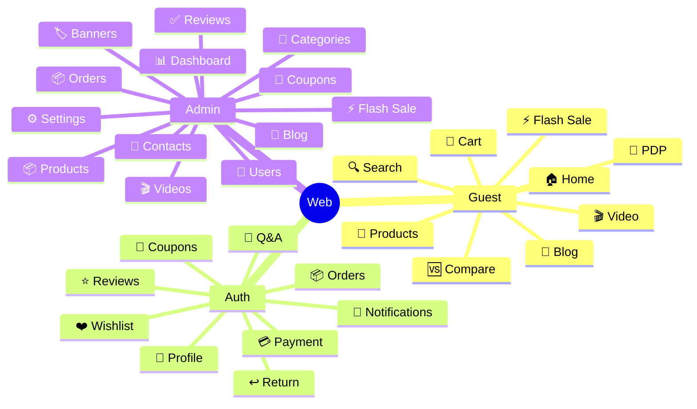

# E-Tech Market Frontend

React 19 SPA cho hệ thống thương mại điện tử E-Tech Market.

## 🛠️ Công Nghệ

- **React** 19
- **Vite**
- **TypeScript**
- **React Router**
- **Axios** - HTTP Client
- **ESLint** - Code linting

## 📄 Trang & Tính Năng

### 👤 Client (Khách hàng)

| Trang | Mô Tả |
| :--- | :--- |
| **Home** | Banner slider, danh mục, flash sale, sản phẩm nổi bật |
| **Products** | Danh sách sản phẩm theo danh mục, lọc, tìm kiếm |
| **Product Detail (PDP)** | Gallery, variant picker, thông số, đánh giá, Q&A, sản phẩm liên quan |
| **Flash Sale** | Danh sách sản phẩm flash sale với countdown |
| **Compare** | So sánh sản phẩm |
| **Cart** | Thêm/cập nhật/xóa sản phẩm |
| **Checkout** | Áp coupon, chọn thanh toán MoMo/VNPAY/COD |
| **Orders** | Danh sách đơn hàng, chi tiết, hủy đơn, xác nhận nhận |
| **Return Request** | Yêu cầu hoàn trả |
| **Wishlist** | Toggle yêu thích |
| **Profile** | Thông tin, avatar, đổi mật khẩu, voucher |
| **Coupons** | Danh sách coupon của user |
| **Notifications** | Danh sách thông báo |
| **Auth** | Login, Register, Forgot Password, Reset Password, Google Login |
| **Blog** | Danh sách và chi tiết bài viết |
| **Video** | Danh sách và chi tiết video |
| **Product News** | Tin tức sản phẩm |
| **Shop Q&A** | Hỏi đáp về sản phẩm |
| **Info Pages** | About, Contact, Privacy, Terms, Refund, Payment Security |

### 👑 Admin

| Trang | Mô Tả |
| :--- | :--- |
| **Dashboard** | Thống kê doanh thu, đơn hàng, sản phẩm |
| **Products** | Quản lý sản phẩm (CRUD) |
| **Product Variants** | Quản lý biến thể |
| **Product News** | Quản lý tin tức |
| **Categories** | Quản lý danh mục |
| **Orders** | Quản lý đơn hàng |
| **Reviews** | Duyệt/từ chối đánh giá |
| **Coupons** | Quản lý coupon |
| **Flash Sales** | Quản lý flash sale |
| **Banners** | Quản lý banner |
| **Videos** | Quản lý video |
| **Video Categories** | Quản lý danh mục video |
| **Blog** | Quản lý blog posts |
| **Users** | Quản lý users (RBAC) |
| **Contacts** | Quản lý liên hệ |
| **Shop Q&A** | Hộp thư Q&A |
| **Notifications** | Gửi thông báo |
| **Settings** | Cấu hình hệ thống |

## 🧩 Use Cases (Mindmap)



## 📂 Cấu Trúc Dự Án

```
src/
├── __tests__/           # Unit tests
├── app/               # App entry & routing
├── assets/            # Static assets (images, fonts)
├── components/       # Shared components
│   ├── icons/
│   ├── ChatWidget
│   ├── CompareTray
│   ├── ConfirmModal
│   ├── ErrorBoundary
│   ├── FooterPage
│   ├── GlobalToastProvider
│   ├── HeaderPage
│   └── Skeleton
├── configs/          # App configuration
├── features/        # Feature modules
│   └── pages/
│       ├── admin/          # Admin pages
│       │   ├── banners/
│       │   ├── blog/
│       │   ├── categories/
│       │   ├── contacts/
│       │   ├── coupons/
│       │   ├── dashboard/
│       │   ├── flashSale/
│       │   ├── notifications/
│       │   ├── orders/
│       │   ├── products/
│       │   ├── reviews/
│       │   ├── settings/
│       │   ├── shopQna/
│       │   ├── users/
│       │   └── videos/
│       └── client/        # Client pages
│           ├── auth/
│           ├── blog/
│           ├── cart/
│           ├── checkout/
│           ├── home/
│           ├── info/
│           ├── notifications/
│           ├── orders/
│           ├── products/
│           │   └── components/
│           ├── profile/
│           ├── video/
│           └── wishlist/
├── hooks/           # Custom React hooks
├── styles/          # Global styles
└── utils/          # Utility functions
```

## 🏃‍♂️ Chạy Ứng Dụng

```bash
# Cài đặt dependencies
npm install

# Chạy dev server
npm run dev

# Build production
npm run build

# Preview production build
npm run preview

# Chạy tests
npm test
```

## ✅ Features

- [x] Home với banner slider
- [x] Danh sách sản phẩm theo category
- [x] Tìm kiếm và lọc sản phẩm
- [x] Chi tiết sản phẩm với variant picker
- [x] So sánh sản phẩm
- [x] Flash Sale với countdown
- [x] Giỏ hàng
- [x] Thanh toán MoMo/VNPAY/COD
- [x] Quản lý đơn hàng
- [x] Yêu cầu hoàn trả
- [x] Wishlist
- [x] Đánh giá sản phẩm
- [x] Shop Q&A
- [x] Thông báo
- [x] Blog & Video
- [x] Admin Dashboard
- [x] RBAC (Admin/Staff/Editor)