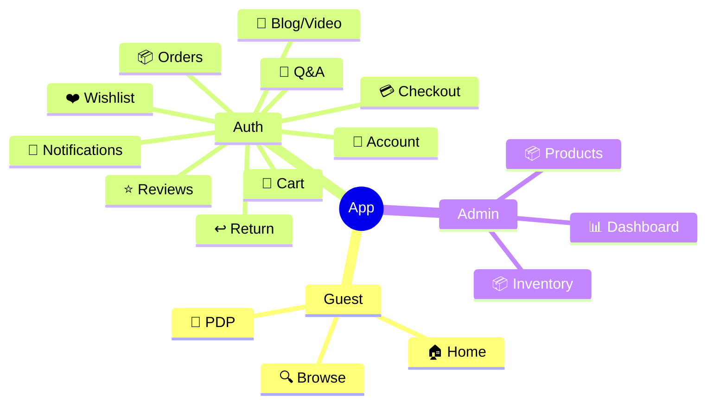

# e_tech_market_app

E-Tech Market Mobile App - Ứng dụng di động cho hệ thống thương mại điện tử E-Tech Market.

## 🛠️ Công Nghệ

- **Flutter** 3.24+
- **Dart**
- **Dio** - HTTP Client
- **Material Design 3**

## 📱 Màn Hình & Tính Năng

### 👤 Client (Khách hàng)

| Màn Hình | Mô Tả |
| :--- | :--- |
| **Home** | Banner slider, tab sản phẩm, flash sale, coupon, newsletter |
| **Browse/Products** | Danh sách sản phẩm theo danh mục, lọc, tìm kiếm |
| **Product Detail (PDP)** | Gallery, variant picker, flash sale price, thông số, sản phẩm liên quan |
| **Cart** | Thêm/cập nhật/xóa sản phẩm |
| **Checkout** | Áp coupon, chọn MoMo/VNPAY/COD, xem kết quả thanh toán |
| **Orders** | Danh sách đơn hàng, chi tiết, hủy đơn, xác nhận nhận hàng |
| **Return Request** | Yêu cầu hoàn trả, xác nhận refund |
| **Wishlist** | Toggle yêu thích, đồng bộ |
| **Shop Q&A** | Xem/đặt câu hỏi về sản phẩm |
| **Reviews** | Gửi đánh giá đa chiều (Hiệu năng, Pin, Camera) |
| **Notifications** | Xem danh sách, đánh dấu đã đọc |
| **Account** | Profile, avatar, đổi mật khẩu, voucher, sản phẩm đã mua |
| **Blog/Video** | Xem danh sách và chi tiết bài viết/video |
| **Maintenance** | Hiển thị màn hình bảo trì khi backend bật mode |
| **Auth** | Login, Register, Forgot Password, Reset Password |

### 👑 Admin

| Màn Hình | Mô Tả |
| :--- | :--- |
| **Dashboard** | Thống kê doanh thu, đơn hàng, sản phẩm |
| **Products** | Quản lý sản phẩm |
| **Inventory** | Quản lý tồn kho theo variant |
| **Orders** | Quản lý đơn hàng |

## 🔌 API Integration

Ứng dụng kết nối với Backend Laravel qua API. URL được cấu hình qua `--dart-define`:

```bash
flutter run --dart-define=API_BASE_URL=http://192.168.1.5:8000/api
```

## 🧩 Use Cases (Mindmap)



## 📂 Cấu Trúc Dự Án

```
lib/
├── config/          # Cấu hình ứng dụng
├── controllers/    # Business logic
├── l10n/          # Đa ngôn ngữ
├── models/         # Data models
├── screens/       # Màn hình UI
│   ├── account/     # Tài khoản
│   ├── admin/      # Admin
│   ├── auth/       # Đăng nhập/đăng ký
│   ├── blogs/      # Blog
│   ├── cart/      # Giỏ hàng
│   ├── checkout/  # Thanh toán
│   ├── home/      # Trang chủ
│   ├── home_sections/
│   ├── notifications/
│   ├── orders/    # Đơn hàng
│   ├── products/  # Sản phẩm
│   ├── search/    # Tìm kiếm
│   ├── videos/   # Video
│   └── wishlist/  # Yêu thích
├── services/     # API services
├── utils/        # Tiện ích
└── main.dart     # Entry point
```

## 🏃‍♂️ Chạy Ứng Dụng

```bash
# Lấy dependencies
flutter pub get

# Chạy debug
flutter run

# Chạy với API tùy chỉnh
flutter run --dart-define=API_BASE_URL=http://192.168.1.5:8000/api
```

## 📦 Build

```bash
# Build APK (Release)
flutter build apk --release

# Build App Bundle (Google Play)
flutter build appbundle --release

# Build iOS (cần macOS)
flutter build ios --release
```

## 📱 Supported Features

- [x] Home với banner slider
- [x] Danh sách sản phẩm theo category
- [x] Tìm kiếm và lọc sản phẩm
- [x] Chi tiết sản phẩm với variant picker
- [x] Flash Sale với countdown
- [x] Giỏ hàng
- [x] Thanh toán MoMo/VNPAY/COD
- [x] Quản lý đơn hàng
- [x] Yêu cầu hoàn trả
- [x] Wishlist
- [x] Đánh giá sản phẩm
- [x] Shop Q&A
- [x] Thông báo
- [x] Blog & Video
- [x] Maintenance mode
- [x] Admin Dashboard (Products, Inventory, Orders)